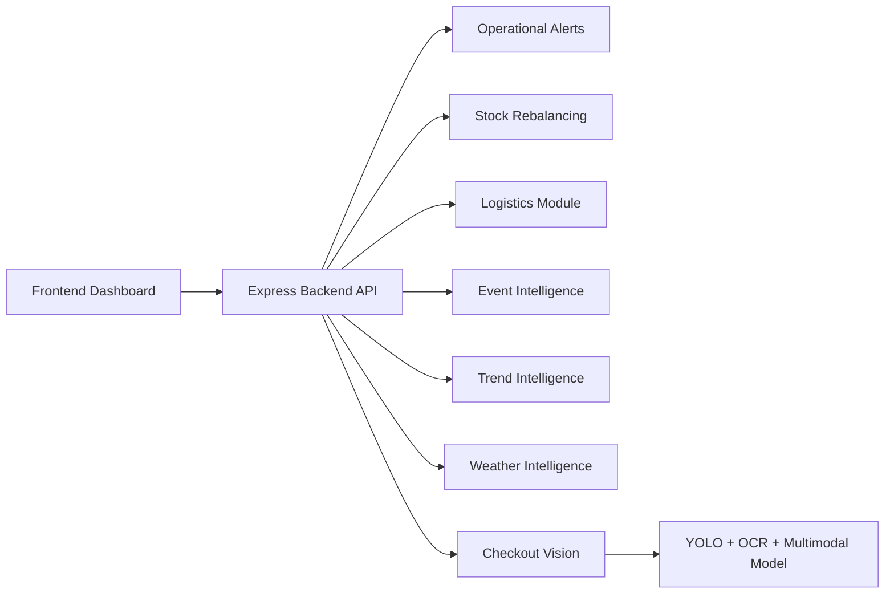
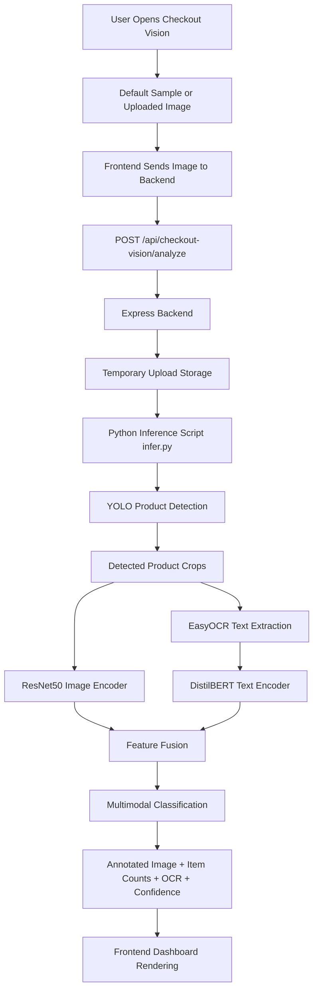

# Smartstock

Smartstock is an AI-assisted warehouse and retail operations platform designed to improve inventory accuracy, reduce operational waste, and give teams a unified view of logistics, demand signals, and checkout verification. The project combines a modern operations dashboard with Python-powered intelligence modules so forecasting, risk detection, and computer vision can live inside one workflow instead of scattered prototypes.

## What Smartstock Solves

Smartstock is built around a practical operations problem: decisions in supply chains often break down because system data and physical reality drift apart. Teams may know what the ERP says is in stock, but they still struggle with:

- delayed or inaccurate inventory visibility
- slow reaction to demand spikes and regional events
- poor coordination between stores, warehouses, and vendors
- shrinkage from missed scans or checkout mismatch
- manual verification work that does not scale

Smartstock addresses that gap with a platform that combines predictive analytics and visual verification.

## Core Capabilities

### 1. Operational Alerts

The alerts workspace surfaces urgent operational issues that require human attention, including:

- imminent stockouts
- checkout anomalies
- logistics delays
- forecast instability
- model or system drift

This helps teams move from passive reporting to active triage.

### 2. Stock Rebalancing

Smartstock identifies opportunities to move inventory between locations when some nodes have excess stock and others face shortages. This is especially useful for perishables and fast-moving goods where delay directly increases waste or lost sales.

### 3. Logistics Visibility

The logistics layer tracks movement of goods between warehouses and stores, highlights delay risk, and provides a more operationally useful picture of transfer status than static shipment logs.

### 4. Federated Learning Workspace

The federated learning panel demonstrates how model updates can be coordinated across distributed nodes without centralizing all local data. This supports privacy-aware AI improvement in a multi-store environment.

### 5. Event, Trend, and Weather Intelligence

Smartstock includes intelligence modules that estimate demand changes from:

- local and regional events
- category momentum and trend shifts
- weather conditions and spoilage-related risk

Together, these modules support more accurate replenishment and planning decisions.

### 6. Checkout Vision

Checkout Vision is the newest integrated feature in Smartstock. It uses computer vision and multimodal classification to verify products present in a checkout or shelf-style image.

The pipeline works in three steps:

1. detect products using YOLO
2. extract visible packaging text using OCR
3. classify each product using a multimodal model that combines image and text features

The result is rendered directly inside the Smartstock frontend and includes:

- annotated image with bounding boxes
- detected item counts
- crop-level evidence cards
- OCR text
- confidence scores

This feature helps bridge the gap between visual verification and inventory operations.

## Technology Stack

### Frontend

- React
- Vite
- Tailwind CSS
- React Router
- component-driven UI patterns

### Backend

- Node.js
- Express
- REST APIs for module access and ML orchestration

### ML / Vision

- Python
- YOLO for product detection
- EasyOCR for text extraction
- PyTorch for multimodal inference
- ResNet50 as image encoder
- DistilBERT as text encoder

## Repository Structure

```text
Warehouse_Optimisation/
  backend/
    controllers/
    routes/
    services/
    ml/
      checkout_vision/
      event_intelligence/
      trend_intelligence/
      weather_intelligence/
      federated/
  frontend/
    public/
    src/
      app/
      components/
      services/
```

## Architecture

### Smartstock Platform Flow



### Checkout Vision Processing Flow



## Checkout Vision Architecture

Checkout Vision is integrated into the platform instead of running as a separate Flask demo.

### Frontend flow

- user opens `/checkout-vision`
- a default sample image is preloaded for easy demo use
- user can also upload a custom image
- frontend sends the image to the backend
- frontend renders the structured result

### Backend flow

- backend receives the uploaded image through `multipart/form-data`
- image is stored temporarily
- backend launches Python inference
- Python returns JSON to the backend
- backend sends the JSON to the frontend

### Inference flow

- YOLO detects product regions
- EasyOCR extracts packaging text
- multimodal classifier combines image and text signals
- final labels and confidences are returned

### API endpoint

`POST /api/checkout-vision/analyze`

Request field:

- `image`

Successful response includes:

- `image_name`
- `annotated_base64`
- `detections`
- `item_counts`

## Checkout Vision Setup

To run Checkout Vision successfully, the following assets must exist locally inside:

`backend/ml/checkout_vision/`

Required files:

- `infer.py`
- `pipeline.py`
- `multimodal_classifier.py`
- `labels.json`
- `weights/`

The `weights/` folder contains the trained model artifacts and is intentionally excluded from git.

## Environment Configuration

Create:

`backend/.env.local`

You can start from:

`backend/.env.example`

Example values:

```env
CHECKOUT_VISION_PYTHON=<path-to-python-with-vision-dependencies>
CHECKOUT_VISION_TIMEOUT_MS=120000
```

`CHECKOUT_VISION_PYTHON` should point to a Python environment that already has:

- ultralytics
- easyocr
- torch
- torchvision
- transformers
- numpy
- opencv-python
- Pillow

## Getting Started

### Prerequisites

- Node.js 18 or later
- npm
- Python 3.10 or later
- local model weights for Checkout Vision

### Install backend dependencies

```powershell
cd backend
npm install
```

### Install frontend dependencies

```powershell
cd ../frontend
npm install
```

### Start the backend

```powershell
cd ../backend
npm start
```

Backend runs on:

`http://localhost:3001`

### Start the frontend

Open a second terminal:

```powershell
cd frontend
npm run dev
```

Frontend runs on:

`http://localhost:5173`

### Open Checkout Vision

```text
http://localhost:5173/checkout-vision
```

The page loads a default sample image and can automatically run analysis when opened.

## Recommended Demo Flow

If you are presenting Smartstock, a good walkthrough is:

1. open the alerts or operations workspace to show the platform context
2. open `Checkout Vision` from the sidebar
3. show the default `multiproduct.png` sample
4. explain the detection, OCR, and multimodal classification pipeline
5. point out the annotated image, item counts, OCR evidence, and confidence values
6. explain how the output can support shrinkage reduction and inventory verification

## Why This Project Matters

Smartstock is not only a dashboard project and not only a machine learning project. Its real value is in connecting operational software with AI inference in a form that looks closer to a deployable internal platform.

The project demonstrates:

- applied AI inside a warehouse workflow
- separation of frontend, backend, and ML concerns
- practical use of computer vision for retail operations
- extensibility for future automation and decision support

## Current Limitations

Like any applied prototype, Smartstock has some current limits:

- checkout vision depends on locally available trained weights
- inference quality depends on image quality, product coverage, and OCR clarity
- results are not yet persisted in a database as historical audit records
- live video processing is not implemented yet
- exact original training dataset statistics for the multimodal model are not fully documented in this deployment branch

## Future Improvements

Planned or possible next steps include:

- map model outputs directly to warehouse SKU IDs
- save inference results for audit history
- support multiple default demo images
- extend image support to live video streams
- connect checkout detections to alerts and downstream actions
- add model monitoring and packaging-drift detection
- improve operational recommendations using the detected checkout results

## Additional Documentation

Detailed Checkout Vision integration notes:

- `MULTIMODAL_CHECKOUT_VISION_INTEGRATION.md`

Review and viva support material:

- `WAREHOUSE_PROJECT_REVIEW_SCRIPT.docx`

## Project Identity

Smartstock is the current platform identity for this repository. Any older references to Walmart OptiFresh or earlier prototype names should be treated as legacy naming from previous iterations.
